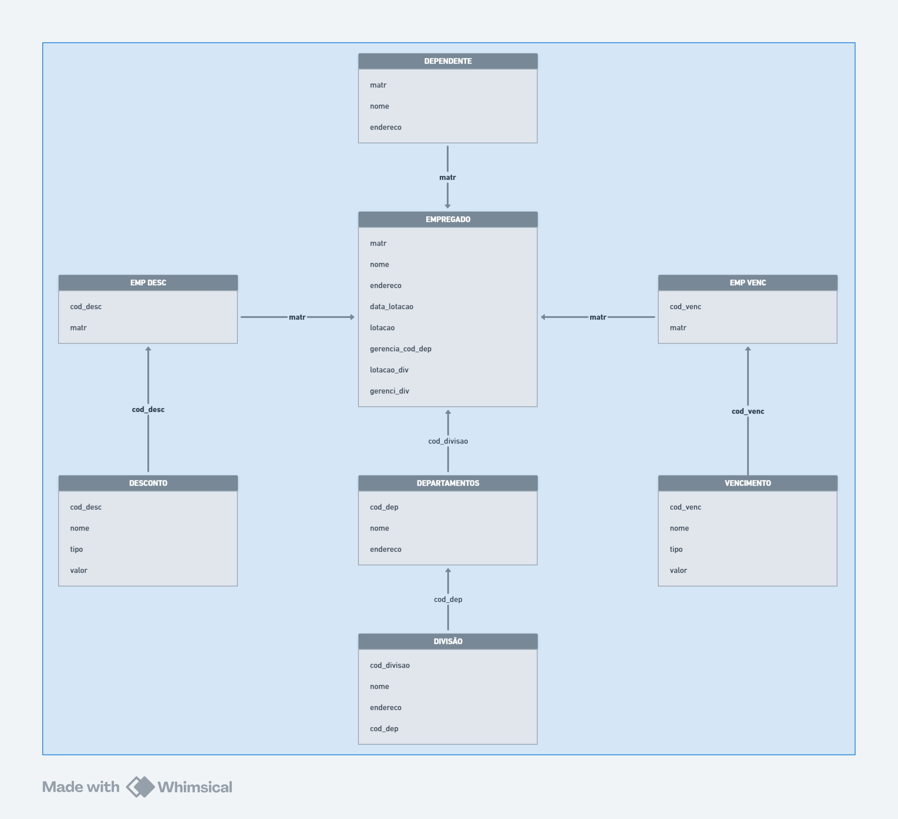

# Desafio Técnico — Lia | Multiplicando Educação

Este repositório contém a solução para o desafio técnico proposto pela empresa **Lia**, com foco em **modelagem, análise e manipulação de dados utilizando SQL** em um contexto de banco de dados relacional.

---

## 📁 Estrutura do Projeto

O banco de dados disponibilizado está dividido em dois cenários:

1. **Corporativo:** Empregados, departamentos, vencimentos e descontos.
2. **Educacional:** Alunos, cursos e escolas.

---

## ✅ Questões Resolvidas

### 📌 Questão 1 — Análise de Matrículas por Escola

#### a. Consulta por escola e por dia

**Tabelas utilizadas:**
- `students (id, name, enrolled_at, course_id)`
- `courses (id, name, price, school_id)`
- `schools (id, name)`

> **Objetivo:** Obter, por **nome da escola** e **por dia**, a **quantidade de alunos matriculados** e o **valor total das matrículas**, considerando apenas cursos cujo nome comece com `"data"`.  
> A ordenação deve ser feita da data mais recente para a mais antiga.

📌 Diagrama da base de dados educacional:  

---

#### b. Estatísticas com soma acumulada e médias móveis

Com base nos resultados da parte anterior, foi feita uma nova análise por **escola e por dia**, incluindo:

- Soma acumulada de matrículas;
- Média móvel de 7 dias;
- Média móvel de 30 dias.

As soluções envolveram **window functions** como `SUM() OVER`, `AVG() OVER`, e cláusulas `FILTER` para recortes específicos.

---

### 📌 Questão 2 — Análise Salarial por Departamento

#### Objetivo

Calcular, para **cada departamento**:

- Quantidade de empregados;
- Média salarial;
- Maior salário;
- Menor salário.

> A ordenação final foi feita pela média salarial de forma decrescente.

---

#### Estratégia

1. **Unificação de dados com CTEs**, a partir de junções entre as seguintes tabelas:
   - `empregado`
   - `vencimento`
   - `desconto`
   - `departamento`
   - `divisao`
   - `emp_venc`
   - `emp_desc`
   - `dependente`

📌 Diagrama da base de dados corporativa:  

2. **Cálculo do salário líquido individual**, levando em conta descontos aplicáveis.
3. **Agregação por departamento** usando `COUNT`, `AVG`, `MAX`, `MIN` e `ROUND`.

---

#### Resultado Final

| Departamento     | Funcionários | Média Salarial | Maior Salário | Menor Salário |
|------------------|--------------|----------------|----------------|----------------|
| TI               | 9            | R$ 8.481,25     | R$ 22.100,00    | R$ 3.650,00     |
| Contabilidade    | 6            | R$ 6.816,67     | R$ 18.800,00    | R$ 3.000,00     |
| Engenharia       | 6            | R$ 5.891,67     | R$ 11.050,00    | R$ 1.900,00     |
